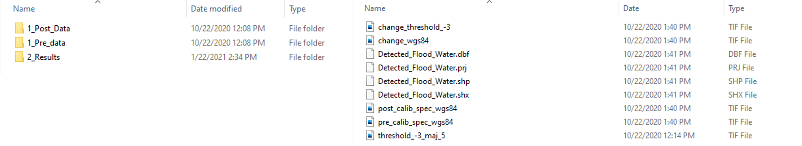
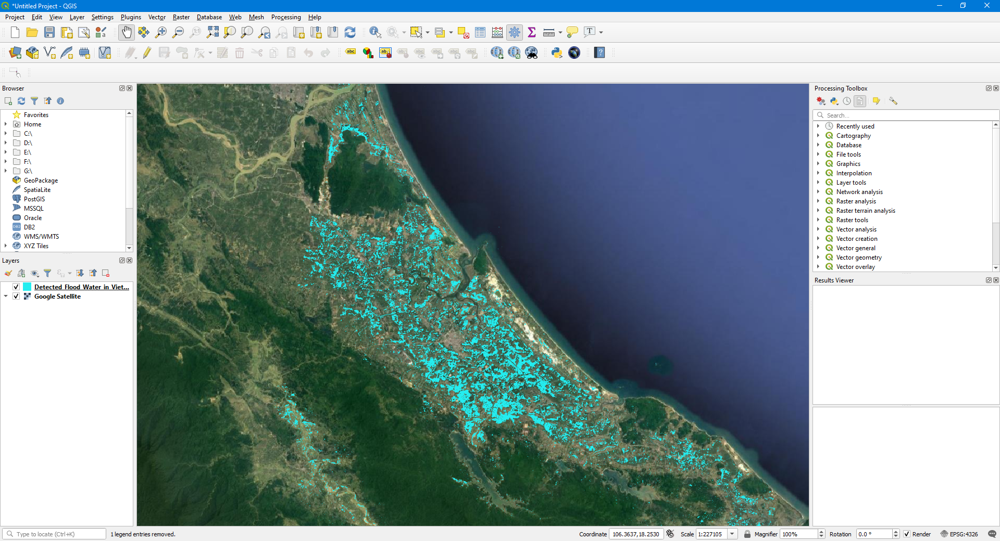

# Realtime-Sentinel1-Flood-Mapping
A Realtime Flood Mapping Approach ( Change Thresholding) Using Sentinel 1 Synthetic Aperture Radar Data with Open Source Python libraries.

# Objective 
This script will give the user access to process Sentinel 1 (Synthetic Aperture Radar) data to detect water areas after a disaster, especially a flood, typhoon, or storm.

# Functionality
This flood mapping approach gives the user a real-time flood (Water Area Detection) mapping using Sentinel 1 data based on threshold technique.
Open SAR Toolkit (OST), SNAP toolbox, WhiteboxTools, and Orfeo toolbox were used in this script.
This powerful and efficient OST provides Sentinel-1 Analysis Ready Data with a lot of processing options. It also opens up for further processing of this data for different applications. 

Link to Open SAR Toolkit (OST)
https://github.com/ESA-PhiLab/OpenSarToolkit 

Link to WhiteboxTools
https://jblindsay.github.io/ghrg/WhiteboxTools/index.html

All the acquisition plans of Sentinel-1 Satellite can be downloaded from this link as kml files. (https://sentinel.esa.int/web/sentinel/missions/sentinel-1/observation-scenario/acquisition-segments/archive) When a disaster occurs, you can visualize this data in Google Earth Pro and get the idea of the timeline of the satellite passing over the region of interest. 

Once the main script is running, it will find the latest Sentinel-1 Images over the defined time and region on interest. If the post-disaster data is not available, this main script will run automatically for pre-defined time intervals until it finds the Post-disaster images. Then the flood extraction is carried out according to the instruction of the Flood_OST_S1.py file. This file includes the main processing steps such as pre-post change image generation, thresholding, majority filtering, and raster polygonization.

# Installation Steps

1. Install anaconda

You can find the installation instruction from this Link.
https://docs.anaconda.com/anaconda/install/

After the installation,install the libraries mentioned below using Anaconda prompt.

    pip install glob2 DateTime GDAL numpy whitebox pathlib APScheduler rasterio pprint36

2. Install OST

You can find the installation instruction from this Link to Open SAR Toolkit (OST).
https://github.com/ESA-PhiLab/OpenSarToolkit 

3. Install SNAP

Install SNAP into the standard directory to OST to find the SNAP command-line executable. 

4. Running Scripts

The main script (Realtime-Sentinel1-Flood-Mapping.ipynb) runs in jupyter notebook environment and the Flood_OST_S1.py can be placed in the same directory as the main script, or it can be placed in the Lib folder of the working anaconda environment (e.g., " C:\Users\User_name\Anaconda3\Lib"). 
Then you can import the Flood_OST_S1 module to the main script. Sentinel1Flood is the class for the processing of the Sentinel-1 ARD data for flood detection.
 
    from Flood_OST_S1 import Sentinel1Flood

# Methodology

This below graph shows the method adopted in this approach

# Output
The results will include the following;

* Processed pre-event and post-event tif files. (In Flood_Result Folder)
* Threshold and majority filtered tif files. 
* Detected Flood water shp file.

Result Floder Structure

Output visualization on QGIS
