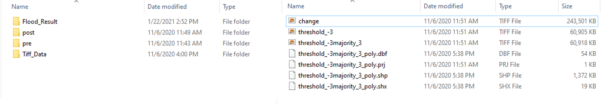
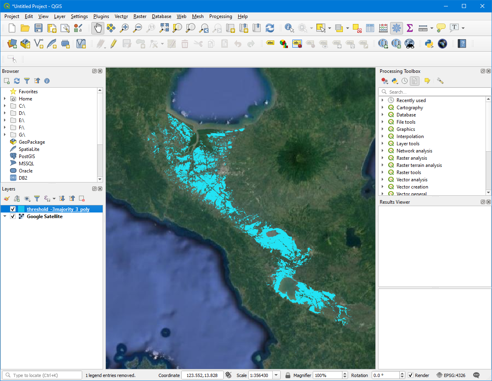

# Realtime-Sentinel1-Flood-Mapping
A Realtime Flood Mapping Approach ( Change Thresholding) Using Sentinel 1 Synthetic Aperture Radar Data with Open Source Python libraries.

# Objective 
This script will give the user access to process Sentinel 1 (Synthetic Aperture Radar) data to detect water areas after a disaster, especially a flood, typhoon, or storm.

# Functionality
This flood mapping approach gives the user a real-time flood (Water Area Detection) mapping using Sentinel 1 data based on threshold technique.
Open SAR Toolkit (OST), SNAP toolbox, WhiteboxTools, and Orfeo toolbox were used in this script.

Link to Open SAR Toolkit (OST)
https://github.com/ESA-PhiLab/OpenSarToolkit 

Link to WhiteboxTools
https://jblindsay.github.io/ghrg/WhiteboxTools/index.html

# Steps
1. Install anaconda
https://docs.anaconda.com/anaconda/install/

3. Install OST

2. Install SNAP

Install SNAP into the standard directory to OST to find the SNAP command-line executable. 

You can find the installation instruction from this Link to Open SAR Toolkit (OST)
https://github.com/ESA-PhiLab/OpenSarToolkit 

"""C:\Users\Chatumal\anaconda3\envs\ost\Lib"""

Flood OST

import os
import datetime
import glob
from osgeo import gdal
from osgeo import ogr
from osgeo import osr
import numpy as np
from whitebox.WBT.whitebox_tools import WhiteboxTools
wbt = WhiteboxTools()

functions

change
thresholding
maj_filtering
ras2poly

main script
import os
from os.path import join
from os.path import join as opj
import glob
from pathlib import Path
from pprint import pprint
from datetime import datetime, timedelta

#Import form OST tool box
from ost import Sentinel1_GRDBatch
from ost.helpers import vector, raster

#Sheduling Tasks
from apscheduler.scheduler import Scheduler

import rasterio
from ost.helpers import helpers as h, raster as ras

#Importing Flood Processing Module
from Flood_OST_S1 import Sentinel1Flood

# Methodology

# 
{:height="300px" width="300px"}
# Output
The results will include the following;

* Processed pre-event and post-event tif files.
* Threshold and majority filtered tif files. 
* Detected Flood water shp file.

